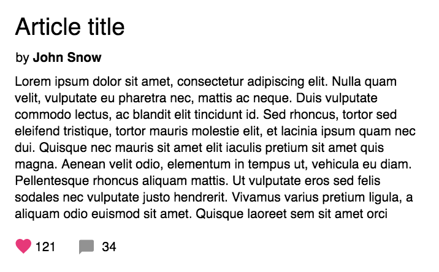
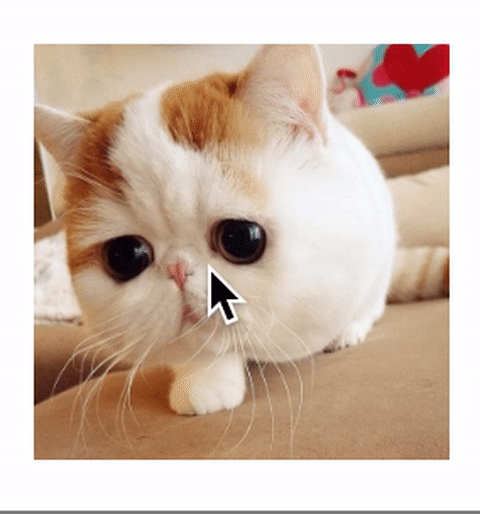
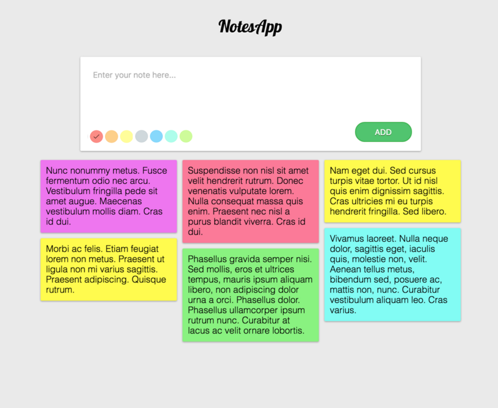
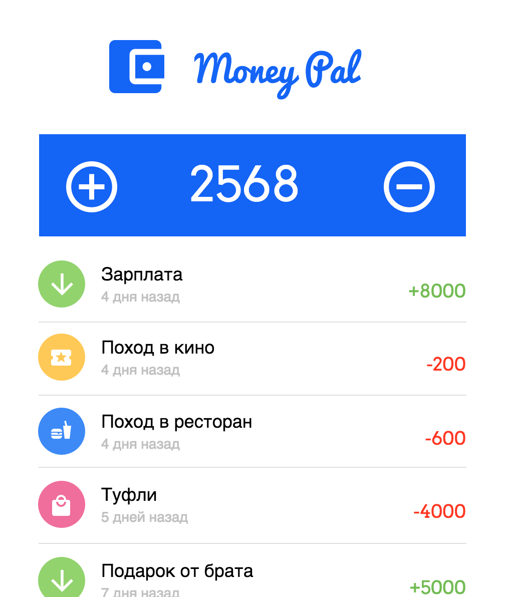

# React Lesson

### Полезности

- [Документация React](https://reactjs.org/docs/hello-world.html)
- [React Components, Elements, and Instances](https://reactjs.org/blog/2015/12/18/react-components-elements-and-instances.html)
- [События](https://reactjs.org/docs/handling-events.html)
- [Lists and keys](https://reactjs.org/docs/lists-and-keys.html)
- [Thinking in React](https://reactjs.org/docs/thinking-in-react.html)
- [JSX](https://reactjs.org/docs/jsx-in-depth.html)
- [Reconciliation](https://reactjs.org/docs/reconciliation.html)
- [Context](https://reactjs.org/docs/context.html)
- [HOC](https://reactjs.org/docs/higher-order-components.html)
- [Create React App](https://github.com/facebookincubator/create-react-app)
- [Мой доклад про перформанс в React](https://www.youtube.com/watch?v=5pIUicKWyrQ)
- [React Kyiv](https://www.meetup.com/Kyiv-ReactJS-Meetup/)

### Homework

#### 1. Напишите компонент для отображения статьи

⭐️

Напишите компонент для отображения статьи, который в качестве параметров принимает Название статьи, ее текст, имя автора, кол-во лайков и комментариев.

Выглядеть это может так:



#### 2.  Flip Card

⭐️

Создайте компонент с карточкой с одной стороны которой находится фото (любое, которое вам нравится), а с другой - просто цветная заливка. При каждом клике на карту стороны должны меняться.




#### 3. Выбор цвета для заметки

⭐️⭐️

При создании новой заметки сделайте выбор для ее цвета. Не используйте `<input type="color">`, сделайте выбор их 5-7 цветов (как в Google Keep).



#### 4. Приложение для учета расходов

⭐️⭐️⭐️

Напишите небольшое приложение для учета расходов / доходов. Вы можете добавлять туда доходы (сумма, название) и свои расходы (сумма, название, категория). Вверху всегда должен быть виден текущий баланс.

Предусмотрите 4 категории для расходов - развлечения, еда, покупки и другое. Для выполнения этого задания вы можете использовать какую-то из библиотек компонентов (React Bootstrap, Material UI, React Mdl, Elemental UI, Belle). Напишите БЕЗ использования Redux/Flux/MobX.



Дополнительно в этом задании:
 - Добавьте сортировку по сумме и дате
 - Добавьте фильтр Все, Только доходы, Только расходы. Соостветственно при клике на вариант фильтрации, на экране должны оставаться только элементы, которые ему соответствуют.
 - Добавьте график по категориям расходов (pie-chart) и график сравнения суммы дохода и суммы расхода.

#### 5. HOCs

⭐️⭐️

Напишите Higher Order Компоненты для решения таких задач:

1) Изменение props. Как аргумент передается объект-маппер для названий props.

```
@mapProps({ foo: 'bar' })
class Component ...

// В компонент передаются такие props

<Component foo="hello" />

// В сам компонент должны прийти props вида { bar: "hello" }

```

2) HOC onlyUpdateForKeys. Не дает компоненту обновляться, если ни один с переданых props не изменен

```
@onlyUpdateForKeys([ 'foo' ])
class Component ...

```

3) HOC shouldComponentRender, который не будет рендерить компонент, если переданная функция-предикат возвращает false

```
@shouldComponentRender(props => props.isLoaded)
class Component ...

```

