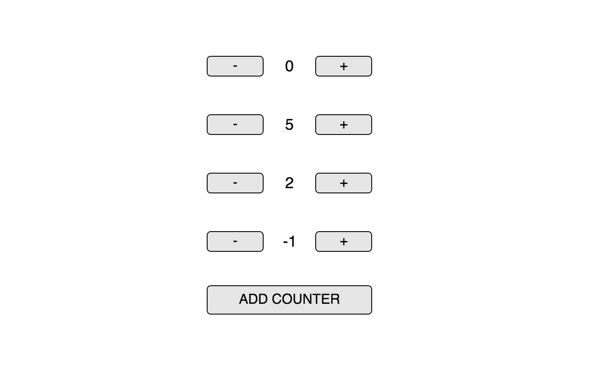
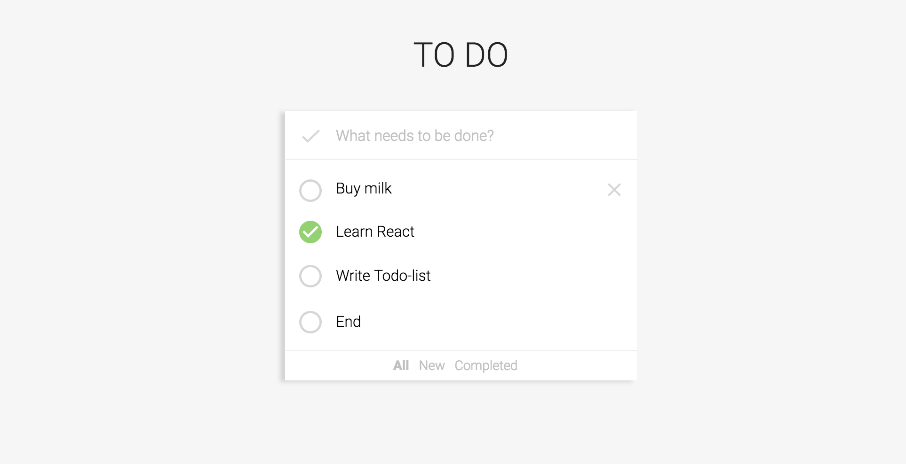
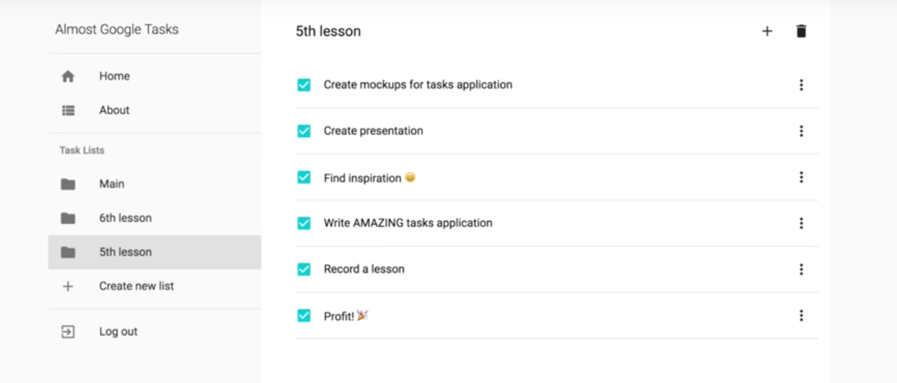

# Redux Lesson

### Полезности

- bal
- bla

### Homework

#### 1. Список счетчиков

⭐️

На основании счетчика, который мы писали на занятии, напишите имплементацию списка счетчиков.

Счетчики должны работать независимо.

#### 2. Список задач

⭐️⭐️

2.1 Добавьте галочку, которая будет отмечать все задачи в списке, как выполненные и удаление задач.

2.2 Реализуйте отправку событий о добавлении задач (удалении, вычеркивании) в Гугл Аналитику (https://www.google.com/analytics/).

3.3 Сделайте синхронизацию списка задач с localStorage c использованием middleware. Напишите middleware самостоятельно.

#### 3. Приложение для учета расходов

⭐️⭐️

Попробуйте теперь приложение для учета расходов с помощью redux. Переиспользуйте компоненты, которые вы написали, но все взаимодействие с данными вынесите в Redux.

#### 4. Async Notes

⭐️⭐️

В папке для выполнения задания лежит папка backend в которой написанный на NodeJS и MongoDB сервер позволяющий работать с заметками.

Используя, API который он предоставляет, сделайте написанное нами ранее приложение для работы с заметками асинхронным.

#### 5. Caching

В коде из примера `03_Real_API` реализуйте кеширование пользователей. Чтобы при переключении с языка на язык, уже ранее подгруженные пользователи не подгружались опять. Также, реализуйте инвалидацию этого кеша по прошествии 1 минуту (это значит, что если с последней загрузки прошло больше, чем 1 минута, мы их загружаем еще раз)

#### 6. Google Tasks

⭐️⭐️⭐️

У Google есть приложение для работы с задачами, но оно крайне устаревшее - https://mail.google.com/tasks/canvas?pli=1

Предлагаю вам модернизировать его и сделать более современным.

Используя Google Tasks API, концепции Material Design и по возможности уже написанные компоненты ранее, напишите небольшое приложение с авторизацией для создания задач в списках.

Должно быть можно:

1. Войти под своим аккаунтом Google
2. Создать список задач с каким-то названием
3. Добавить / удалить / отметить как выполненную любую из задач списка
4. Удалить список задач
5. Фильтрация (Все / Новые / Выполненные)
6. Обязательно должно быть задеплоено. Используйте для деплоя что душе угодно (GitHub Pages, Heroku...)
7. Реализуйте оптимистичное выполнение задач (т.е. они должны отмечаться как выполненные раньше, чем фактически прийдет ответ с сервера)

